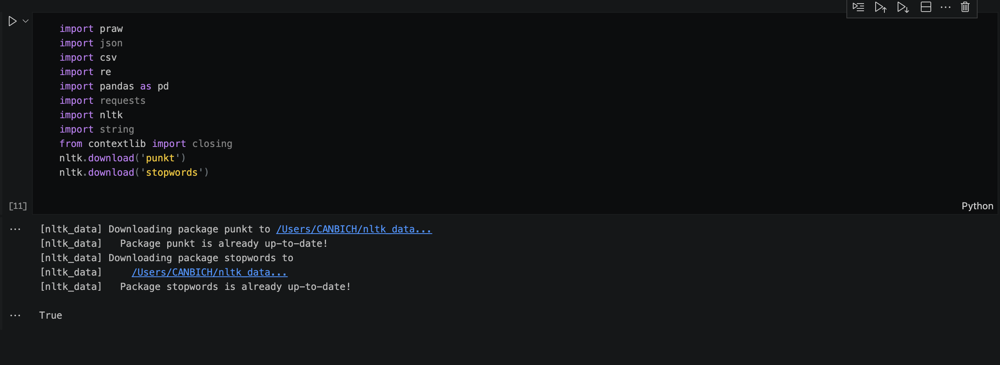
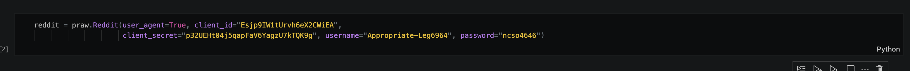
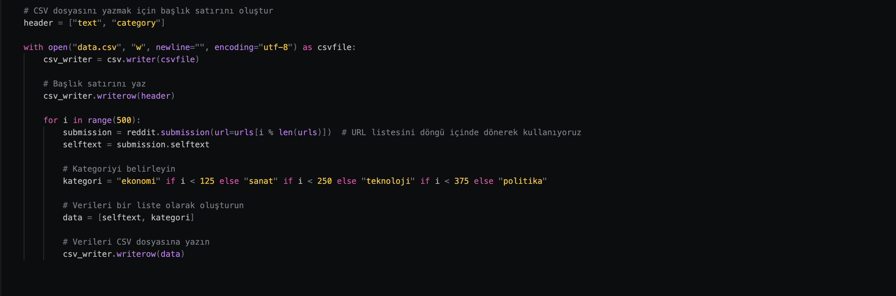
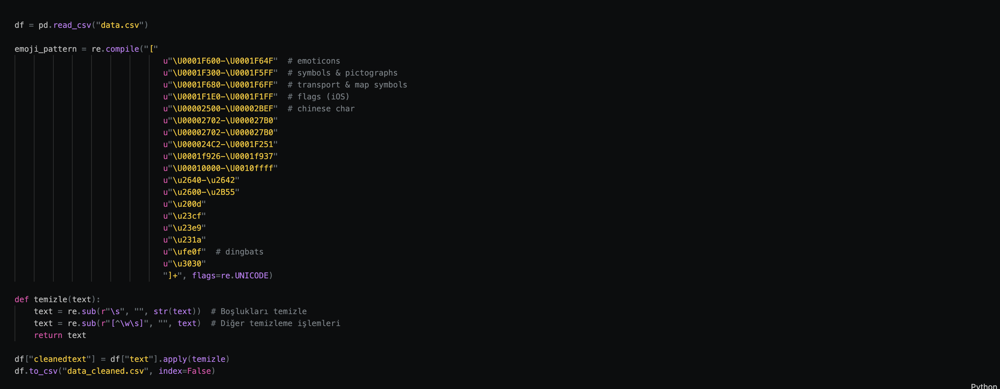

# Reddit_Konu_Tahmini
Reddit'teki postların text'ine bakılarak hangi konuya ait olduğunu bulmak
Öncelikle projemiz için gerekli olan kütüphaneleri bu alandan import ediyoruz.

Reddit Api'sini kullanabilmemiz için Authorization sağlamamız gerekiyor. 

Praw API kullanarak Redditteki post'ların self textini alabilmekteyiz. Alacağımız postların urllerini aşağıda liste şeklinde eklemekteyiz.

Csv dosyamızı oluştururken başlangıçta iki adet sütunumuz mevcut. Bir sütunda textler, bir sütunda ise kategoriler tutuluyor. Kategoriler döngü içerisinde 125'er tane olacak şekilde Ekonomi,Sanat,Teknoloji,Politika konu başlıklarıyla dolduruluyor.

Bu kısımda ise almış olduğumuz self textler halihazırda kirli olduğu için temizleme işlemlerini gerçekleştiriyoruz. Textlerimizi emojilerden, aralardaki boşluklardan, sembollerden arındırıyoruz
